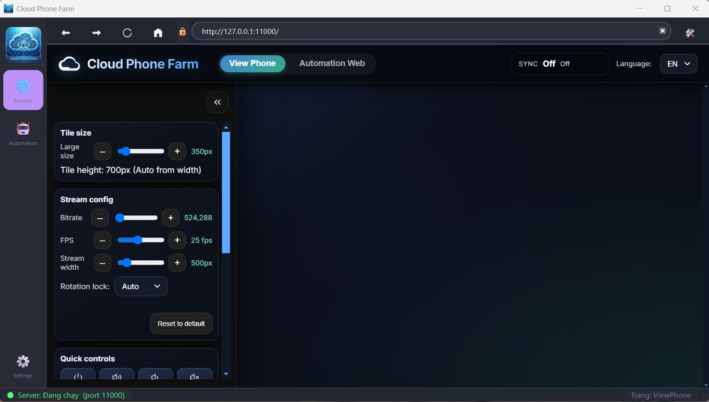
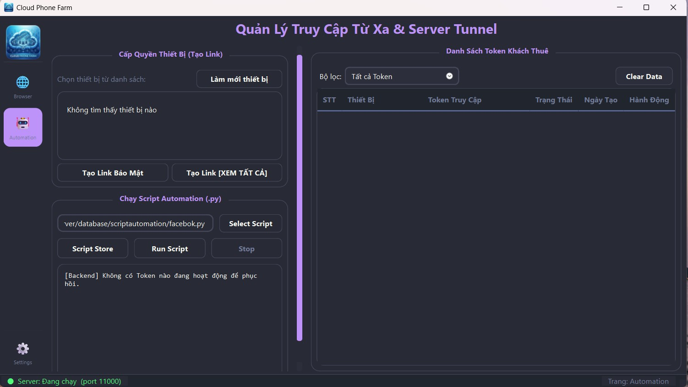

# 📱 CloudPhone Farm

**CloudPhone Farm** là giải pháp quản trị và điều khiển điện thoại thông minh tập trung, được thiết kế với giao diện hiện đại, hiệu năng cao và khả năng mở rộng không giới hạn cho các hệ thống Phone Farm chuyên nghiệp.

---

## 🚀 Tính năng nổi bật

### 1. 🖥️ Quản lý màn hình tập trung (View Phone)
Cho phép quan sát và điều khiển hàng loạt thiết bị điện thoại cùng lúc thông qua giao diện trình duyệt tích hợp mượt mà.
*   **Hỗ trợ độ trễ thấp:** Tối ưu hóa luồng dữ liệu truyền tải hình ảnh từ thiết bị.
*   **Tương tác thời gian thực:** Click, vuốt, gõ phím trực tiếp trên màn hình máy tính.

*Hình 1: Giao diện quản lý và xem màn hình điện thoại tập trung.*

### 2. 🤖 Hệ thống Automation mạnh mẽ
Tự động hóa các tác vụ lặp đi lặp lại trên thiết bị một cách dễ dàng và chính xác.
*   **Quản lý Script:** Hỗ trợ chạy các kịch bản tự động hóa tùy chỉnh.
*   **Quản lý Token:** Hệ thống lưu trữ và phục hồi trạng thái làm việc (active tokens) thông minh.

*Hình 2: Hệ thống quản lý và vận hành kịch bản tự động hóa.*

### 3. 🌐 Kết nối từ xa (Cloudflare Tunnel)
Tích hợp sẵn công nghệ Cloudflare Tunnel, cho phép bạn truy cập và điều khiển hệ thống Phone Farm từ bất cứ đâu trên thế giới mà không cần mở port modem phức tạp.
*   **Domain tùy chỉnh:** Cấu hình tên miền riêng để quản lý từ xa.
*   **Bảo mật:** Mã hóa dữ liệu truyền tải qua đường truyền an toàn của Cloudflare.

### 4. 🛠️ Công cụ hỗ trợ tận tâm
*   **Khởi động thông minh:** Tự động kiểm tra và khởi chạy NodeJS Server ngầm.
*   **Cập nhật tự động (Auto Update):** Hệ thống tự động so sánh phiên bản với GitHub và cập nhật tệp tin hệ thống an toàn (Safe-Replace logic).
*   **Xác thực License:** Bảo vệ quyền lợi người dùng thông qua mã định danh phần cứng (HWID).

---

## 🎨 Giao diện cao cấp
Sử dụng bộ palette màu **Dracula-inspired** kết hợp với thư viện **PySide6 (Qt)**, mang lại trải nghiệm chuyên nghiệp, mượt mà và thân thiện với người dùng.

## 🛠️ Công nghệ sử dụng
*   **Frontend:** PySide6 (Python Qt), CustomTkinter (Updater).
*   **Backend:** NodeJS (Server điều khiển), ADB (Android Debug Bridge).
*   **Cloud:** Cloudflare Tunnel.
*   **Database:** SQLite (SQLAlchemy).

---

© 2026 CloudPhone Farm. All Rights Reserved.
